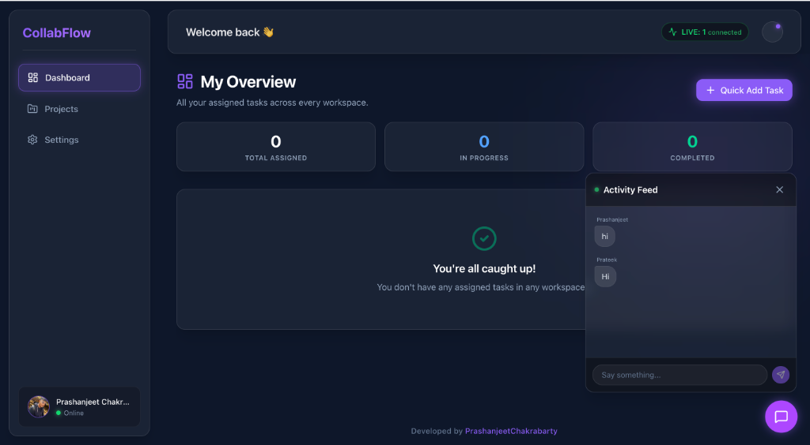
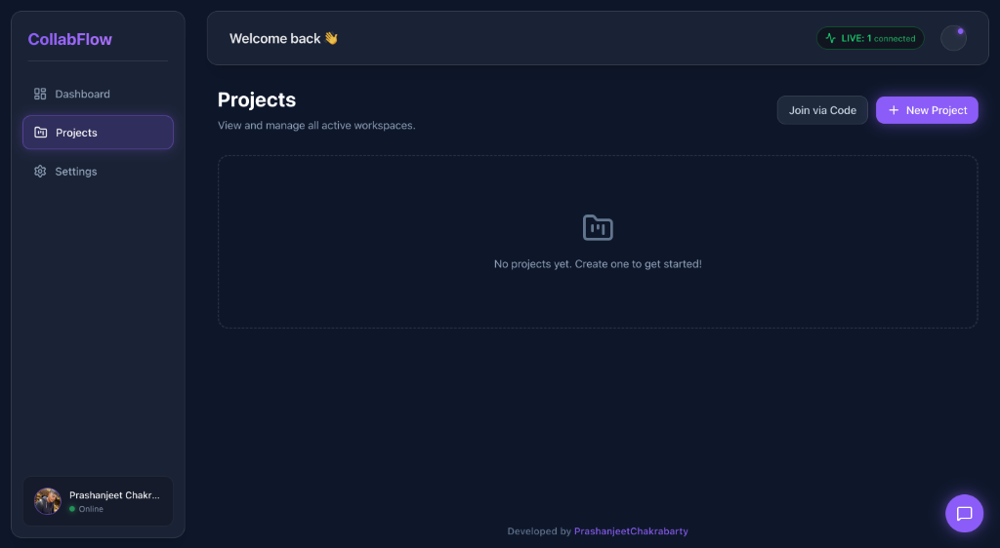
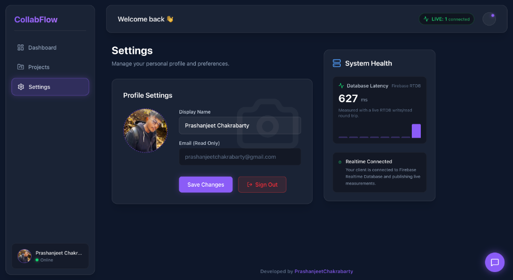

# CollabFlow - Real-Time Collaborative Workspace

<div align="center">
  
  
  
  
</div>
CollabFlow is a modern, high-performance web application designed to help teams manage their workflows, track tasks, and communicate in real-time. Built entirely as a Single Page Application (SPA), it provides a seamless, app-like experience right in the browser. 

I built this project to solve the common issue of fragmented team communication merging the visual organization of a Kanban board with the immediacy of live chat, all within dedicated, secure project workspaces.

---

## 🚀 Live Demo

Experience the live application here: **[CollabFlow Web App](https://collabflowweb-7158f.web.app)**

*To test the real-time features, try opening the link in two different browsers (or an incognito window) and join the same project workspace using the 6-character invite code!*

---

## ✨ Core Features

### 1. Isolated Project Workspaces
- Create unlimited distinct project environments.
- Generate secure **6-character Invite Codes** to easily onboard teammates.
- Workspaces contain exclusively scoped task boards and chat logs so discussions never bleed into other projects.

### 2. Real-Time Kanban Board
- Fully interactive Drag & Drop interface powered by `@dnd-kit/core`.
- Real-time synchronization: Move a card on your screen, and watch it instantly update on your team's screens via Firebase Firestore listeners.
- Assigned tasks are tied heavily to authentication, allowing users to filter the board to only see their specific responsibilities.

### 3. Live Activity Feed (Chat)
- Sub-100ms message synchronization for immediate communication.
- **Privacy First:** The chat feed features an automated self cleaning mechanism. Any message older than 3 days (72 hours) is permanently wiped from the database to reduce clutter and maintain operational security.

### 4. Global Dashboard
- A unified view of your entire workload. The dashboard pulls in every task assigned to you across *all* active projects.
- Features a "Quick Add" utility to dispatch new tasks to any project without leaving the dashboard.
- Live tracking of your total tasks, in-progress items, and completed objectives.

### 5. Seamless Authentication & Profiles
- Secure Email/Password or 1-Click Google Sign-In.
- Profile management with custom avatar uploads powered by Supabase Storage.

---

## 🛠️ Technology Stack

I manually constructed this application using a modern, scalable architecture designed for high-throughput collaborative environments:

**Frontend Ecosystem:**
- **React 18 & Vite:** For lightning-fast Hot Module Replacement (HMR) during development and highly optimized production builds.
- **TypeScript:** Enforcing strict type safety across all database models (Projects, Tasks, Users) to eliminate runtime errors.
- **Zustand:** A lightweight, un-opinionated state management solution used to maintain the active user session and UI layout states globally without prop-drilling.
- **Tailwind CSS (v4):** Utilizing a custom "Orbit UI" design system composed of deep obsidian backgrounds, Electric Violet accents, and heavy use of CSS glassmorphism.
- **Framer Motion:** Powering the cinematic 3D entry animations on the authentication screens and the fluid physics of the Kanban cards.

**Backend Services:**
- **Firebase Authentication:** Handling secure JWT token generation and user session management.
- **Firebase Firestore (NoSQL):** Reactively syncing the Kanban board state and Project metadata across connected clients.
- **Firebase Realtime Database (RTDB):** Dedicated to the low-latency Live Chat and maintaining the "Online Users" presence system.
- **Supabase Storage:** Providing a generous, fast CDN bucket for user-uploaded profile avatars to avoid Firebase region-locking issues.

---

## 🔮 Future Scope & Roadmap

While the core collaborative engine is complete, I plan to expand CollabFlow in several directions:

1. **Role-Based Access Control (RBAC):** Implementing intricate permission levels (Viewer, Editor, Admin) within workspaces so project owners can lock specific columns or restrict task deletion.
2. **File Attachments:** Allowing users to drag and drop PDFs or images directly onto Kanban cards, utilizing Supabase Storage to handle the file blobs.
3. **Rich Text Editing:** Upgrading the task description fields to support Markdown, code blocks, and inline image pasting for better technical documentation.
4. **Third-Party Integrations:** Building webhooks to automatically sync task movements with GitHub Issues or send summarized daily updates to Slack/Discord channels.

---

## 💻 Local Development Setup

If you want to clone this repository and run it locally, follow these steps:

1. **Clone the repository:**
   ```bash
   git clone https://github.com/yourusername/CollabFlow.git
   cd CollabFlow
   ```

2. **Install dependencies:**
   ```bash
   npm install --legacy-peer-deps
   ```

3. **Environment Setup:**
   Create a `.env` file in the root directory and add your own backend credentials:
   ```env
   VITE_FIREBASE_API_KEY=your_firebase_api_key
   VITE_SUPABASE_URL=your_supabase_url
   VITE_SUPABASE_ANON_KEY=your_supabase_anon_key
   ```

4. **Start the Development Server:**
   ```bash
   npm run dev
   ```
   The app will typically be available at `http://localhost:5173`. Let the collaboration flow!
